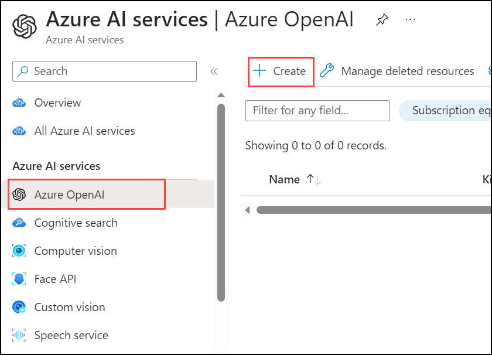
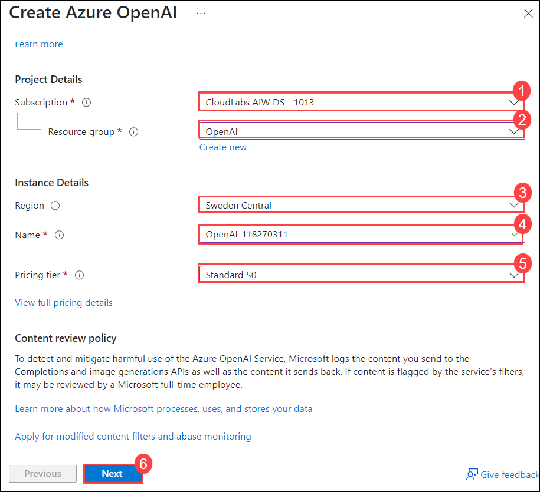
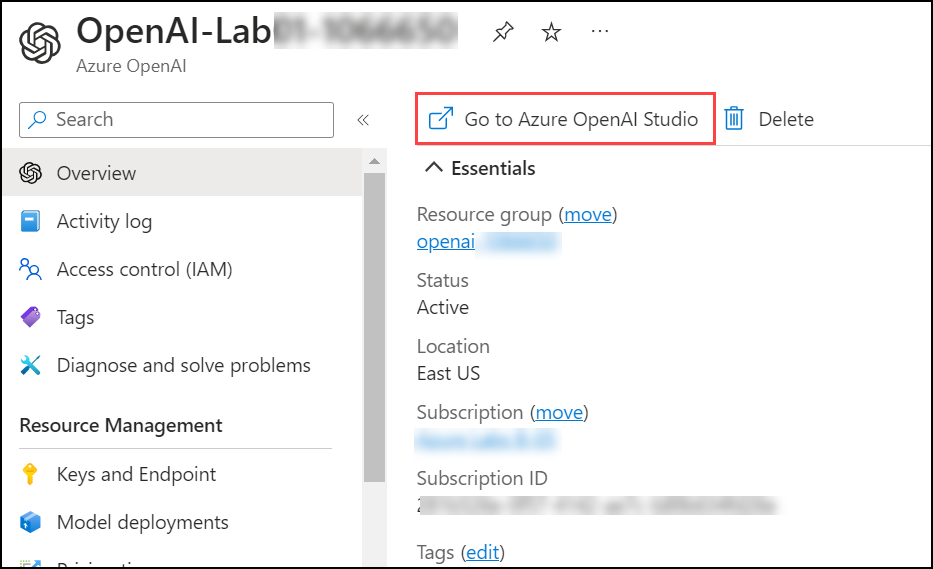
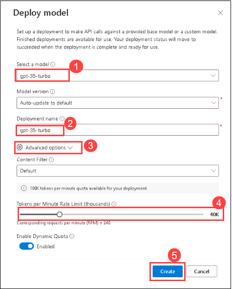
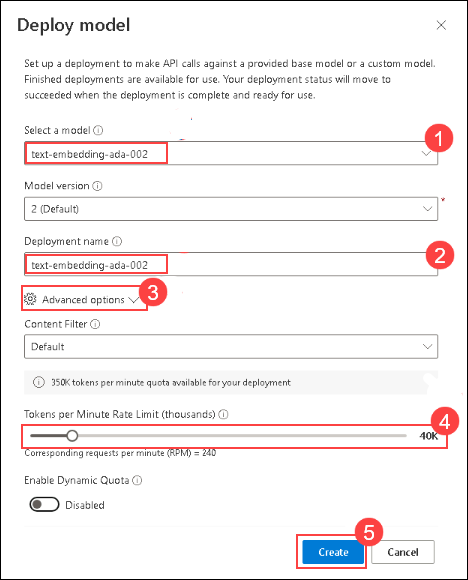
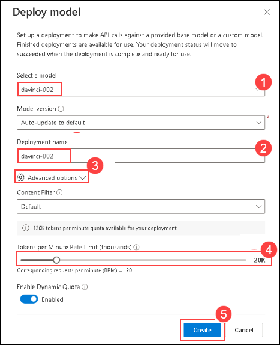

# Exercise 1: Getting Started with Azure OpenAI

In this exercise, you will create a deployment and model in Azure OpenAI studio which you will be using in further exercises.
   
## Task 1: Deploy Azure OpenAI Model.

1. In the **Azure portal**, search for **OpenAI** and select **Azure OpenAI**.

   

2. On **Azure AI Services | Azure OpenAI** blade, click on **Create**.

   

3. Create an **Azure OpenAI** resource with the following settings:
   
    - **Subscription**: Default - Pre-assigned subscription. (1)
    - **Resource group**: OpenAI (2)
    - **Region**: Sweden Central
    - **Name**: OpenAI-<inject key="Deployment ID" enableCopy="false"></inject> (4)
    - **Pricing tier**: Standard S0 (5)
    -  Click **Next** (6)
  
      
      
      >**Note:** Kindly select Sweden Central region only as the resources are region-specific.

4. Keep rest as default click on Next twice and subsequently click on **Create** .
5. Wait for deployment to complete. Then go to the deployed Azure OpenAI resource in the Azure portal.

### Task 2: Deploy a model

Azure OpenAI provides a web-based portal named **Azure OpenAI Studio**, that you can use to deploy, manage, and explore models. You'll start your exploration of Azure OpenAI by using Azure OpenAI Studio to deploy a model.

1. In the **Azure portal**, search for **OpenAI** and select **Azure OpenAI**.

   

2. On **Azure AI Services | Azure OpenAI** blade, select **OpenAI-<inject key="Deployment ID" enableCopy="false"></inject>**

   

3. In the Azure OpenAI resource pane, click on **Go to Azure OpenAI Studio** it will navigate to **Azure AI Studio**.

   
   
5. In **Welcome to Azure OpenAI Service** page, click on **Create new deployment**.

   

6. In the **Deployments** page, click on **+ Create new deployment**.

   

7. Within the **Deploy model** pop-up interface, enter the following details and then click on **Advanced options (3)** followed by scaling down the **Tokens per Minute Rate Limit (thousands) (4)**:
    
    - **Select a Model**: gpt-35-turbo (1)
    - **Model version**: Auto-update to default (2)
    - **Deployment name**: gpt-35-turbo (3)
    - **Tokens per Minute Rate Limit (thousands)**: 40K (4)

      

8. Click on the **Create** (5) button to deploy a model that you will be playing around with as you proceed.

9. In the **Deployments** page, click on **+ Create new deployment**.

   

10. Within the **Deploy model** pop-up interface, enter the following details and then click on **Advanced options (3)** followed by scaling down the **Tokens per Minute Rate Limit (thousands) (4)**:
    
    - **Select a Model**: text-embedding-ada-002 (1) 
    - **Model version**: 2(Default) (2)
    - **Deployment name**: text-embedding-ada-002 (3)
    - **Tokens per Minute Rate Limit (thousands)**: 40K (4)
  
      

11. Click on the **Create** (5) button to deploy a model that you will be playing around with as you proceed.

12. In the **Deployments** page, click on **+ Create new deployment**.

      

13. Within the **Deploy model** pop-up interface, enter the following details and then click on **Advanced options (3)** followed by scaling down the **Tokens per Minute Rate Limit (thousands) (4)**:
    
    - **Select a Model**: davinci-002 (1)
    - **Model version**: (Default) (2)
    - **Deployment name**: davinci-002 (3)
    - **Tokens per Minute Rate Limit (thousands)**: 20K (4)
  
      

14. Click on the **Create** (5) button to deploy a model that you will be playing around with as you proceed.

      >**Note:** Azure OpenAI includes multiple models, each optimized for a different balance of capabilities and performance. In this exercise, you'll use the **GPT-35-Turbo** model, which is a good general model for summarizing and generating natural language and code. For more information about the available models in Azure OpenAI, see [Models](https://learn.microsoft.com/azure/cognitive-services/openai/concepts/models) in the Azure OpenAI documentation.

### Task 3: Explore Azure AI Studio

You can deploy, manage, and explore models in your Azure OpenAI Service by using Azure AI Studio.

1. On the Overview page for your Azure OpenAI resource, use the Explore button to open Azure AI Studio in a new browser tab. Alternatively, navigate to [Azure AI Studio](https://oai.azure.com/) directly.

   

1. View the pages available in the pane on the left. You can always return to the home page at the top. Additionally, AI Studio provides multiple pages where you can:

   - Experiment with models in a playground.
   - Manage model deployments and data.

## Proceed to Exercise 2
