# Exercise 8: Knowledge Mining with Azure Cognitive Search

Unlock the potential of knowledge mining with Azure Cognitive Search. Seamlessly organize and extract insights from vast amounts of unstructured data. Leverage AI-powered capabilities to enrich content, enable powerful search experiences, and gain valuable business intelligence. Transform information into actionable knowledge with Azure Cognitive Search's advanced search and analytics features.

## Lab objectives

In this lab, you will perform:

- Provision an Azure OpenAI resource
- Deploy a model
- Provision an Azure AI service
- Set up the configuration for AI Orchestration and perform various tasks related to ACS.

## Architecture Diagram

   

### Task 1: Provision an Azure AI services

Before you can use Azure AI services, you must provision an Azure AI services resource in your Azure subscription.

1. In the **Azure portal**, search for **AI Search** and select **AI Search**.

   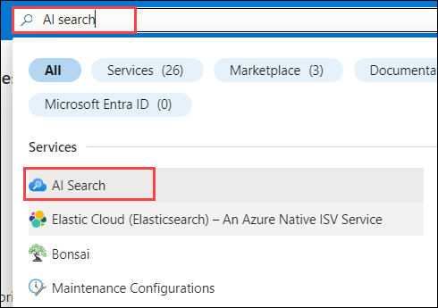

1. In the **Azure AI services | AI Search**, click on **Create**.

   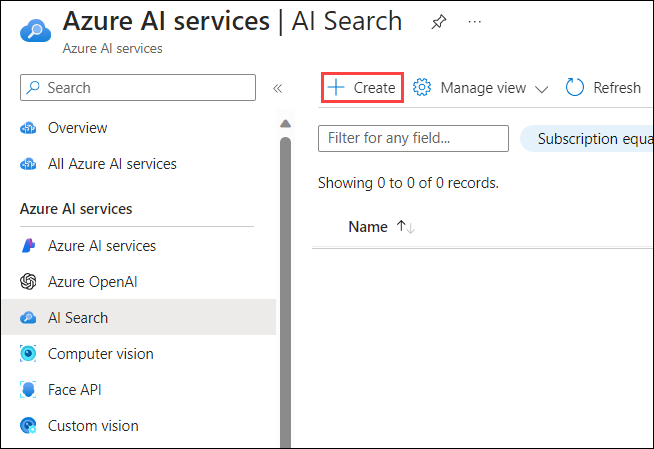

1. Create a **search service**, resource with the following settings and click on **Review + Create**:
   
    - **Subscription**: Default - Pre-assigned subscription.
    - **Resource group**: labvm-rg-<inject key="Deployment ID" enableCopy="false"></inject>
    - **Region**: Select <inject key="Region" enableCopy="false" />
    - **Name**: cognitive-search-service-<inject key="Deployment ID" enableCopy="false"></inject>
    - **Pricing tier**: Basic

     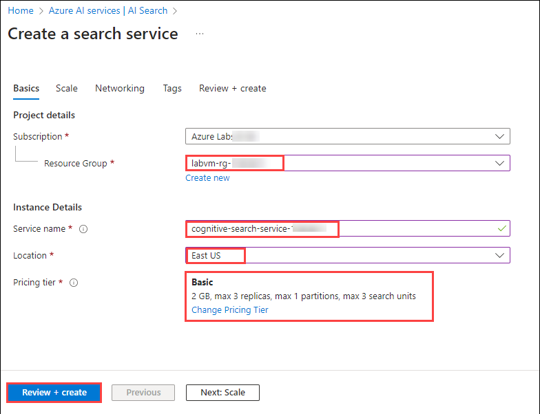

1. In the **Review + Create**, click on **Create**.

     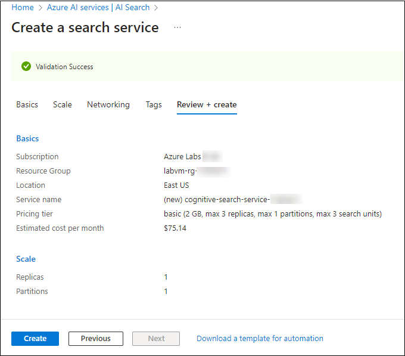

1. Once the deployment has succeeded, click on **Go To Resources**.

     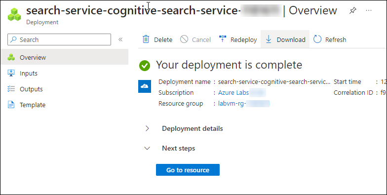

1. In the overview page of **cognitive-search-service-<inject key="Deployment ID" enableCopy="false"></inject>** Search Service copy the **Url**  and paste the values it a Notepad we need this value in the future exercise.

     
   

1. In the **cognitive-search-service-<inject key="Deployment ID" enableCopy="false"></inject>**, click on **Keys** under Setting from the left menu, copy the **Primary admin key**, and paste the values it a Notepad we need this value in the future exercise.

     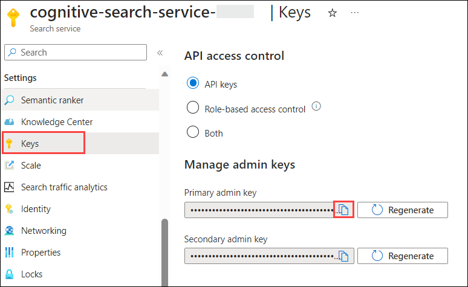

### Task 2: Setup configuration for AI Orchestration

1. Open **Visual Studio Code** from the Lab VM desktop by double-clicking on it.

   

1. In Visual Studio Code from menu bar select **File(1)>open folder(2)**.   

   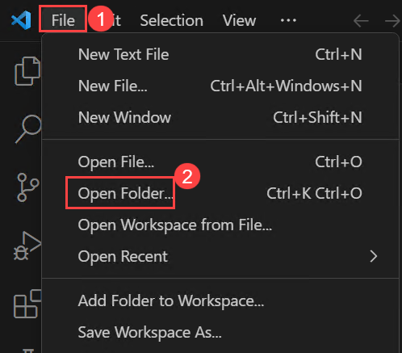

1. Within **File Explorer**, navigate to **C:\LabFiles** select **intro-to-intelligent-apps-main**(1) click on **Select folder(2)**

   

1. In **Visual Studio Code**, click on **Yes, I trust the authors** when **Do you trust the authors of the files in this folder?** window prompted.

   

1. Click on **.env** file replace the values and save the file by pressing **ctrl + s**.

   | **Variables**                            | **Values**                                                                              |
   | ---------------------------------------- |-----------------------------------------------------------------------------------------|
   | OPENAI_API_TYPE                          |  **azure**                                                                              |
   | OPENAI_API_KEY                           | Replace the value with the **AZURE OPENAI API KEY** which you noted in Task 2 step 3    |
   | OPENAI_API_BASE                          | Replace the value with the **AZURE OPENAI ENDPOINT** which you noted in Task 2 step 3   |
   | OPENAI_COMPLETION_MODEL                  | **gpt-35-turbo**                                                                        |
   | AZURE_OPENAI_COMPLETION_DEPLOYMENT_NAME  | **gpt-35-turbo**                                                                        |
   | AZURE_OPENAI_EMBEDDING_DEPLOYMENT_NAME   | **text-embedding-ada-002**                                                              |
   | AZURE_COGNITIVE_SEARCH_SERVICE_NAME      |  **cognitive-search-service-<inject key="Deployment ID" enableCopy="false"></inject>**  |
   | AZURE_COGNITIVE_SEARCH_ENDPOINT_NAME     | Replace the value with the **COGNITIVE SEARCH Url** which you noted in Task 3 step 6    |
   | AZURE_COGNITIVE_SEARCH_INDEX_NAME        | **cognitive-search-lc-python-index**                                                    |
   | AZURE_COGNITIVE_SEARCH_API_KEY           | Replace the value with the **COGNITIVE SEARCH API Key** which you noted in Task 3 step 7|

   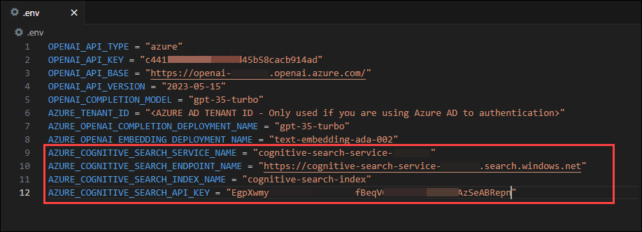

### Task 3: AI Orchestration with Azure Cognitive Search

In this task, we'll walk through using one of Azure's vector stores, Azure Cognitive Search.

1. In the Visual Studio Code navigate to **intro-to-intelligent-apps-main\labs\03-orchestration\04-ACS** folder and select **acs-lc-python.ipynb**.

   

   > **Note**: In Task 4 we have already updated the values for **AZURE_COGNITIVE_SEARCH_SERVICE_NAME, AZURE_COGNITIVE_SEARCH_ENDPOINT_NAME, AZURE_COGNITIVE_SEARCH_INDEX_NAME, AZURE_COGNITIVE_SEARCH_API_KEY**.

1. From the right corner click on **select Kernal** and on the Choose a Kernel source pop-up, select available **Python 3.10.0** env. This will set the Python Environment.

   

1. **Execute the notebook cell by cell** (using either Ctrl + Enter to stay on the same cell or Shift + Enter to advance to the next cell) and observe the **results of each cell** execution.
  
   > **Note**: Make sure **Python Environmen** is in a ready State, If not please wait for 15 to 20 seconds.

      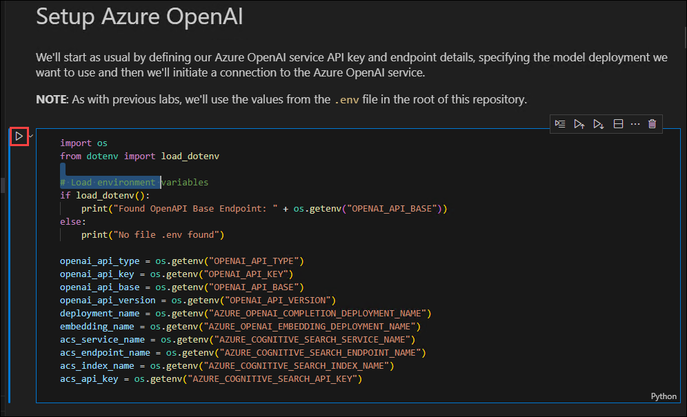   

1. In the Visual Studio Code navigate to **intro-to-intelligent-apps-main\labs\03-orchestration\04-ACS** folder and select **acs-sk-csharp.ipynb**.

   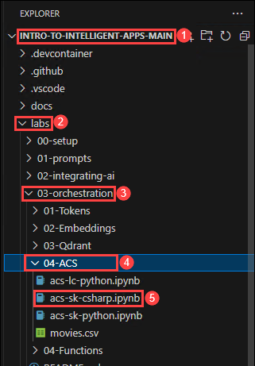

1. From the right corner click on **select Kernal** and on the Choose a Kernel source pop-up, select available **Select Another Kernal**. As we required .Net Kernal to perform  the exercise. 

   

1. Select **.Net Interactive** as a kernel

   

1. In the Visual Studio Code navigate to **.env**, update the **AZURE_COGNITIVE_SEARCH_INDEX_NAME** with **cognitive-search-sk-csharp-index**,  and save the file by pressing **ctrl + s** .

       

1. Navigate back to **acs-sk-csharp.ipynb** file, **execute the notebook cell by cell** (using either Ctrl + Enter to stay on the same cell or Shift + Enter to advance to the next cell), and observe the **results of each cell** execution. 

   > **Note**: Make sure **.Net Interactive** is in ready State, If not please wait for 15 to 20 seconds.

      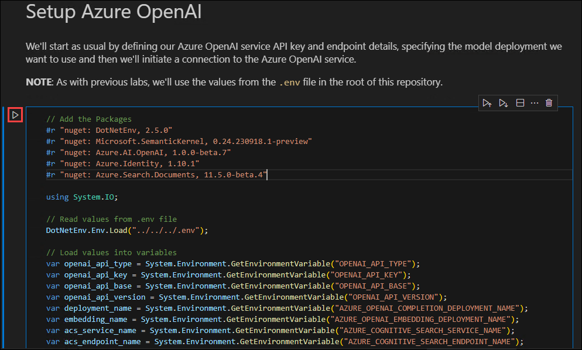 

1. In the Visual Studio Code navigate to **intro-to-intelligent-apps-main\labs\03-orchestration\04-ACS** folder and select **acs-sk-python.ipynb**.

   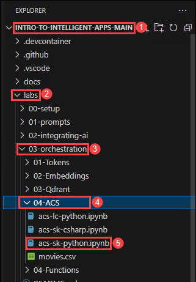

1. From the right corner click on **select Kernal** and on the Choose a Kernel source pop-up, select available **Python 3.10.0** env. This will set the Python Environment.

   

1. In the Visual Studio Code navigate to **.env**, update the **AZURE_COGNITIVE_SEARCH_INDEX_NAME** with **cognitive-search-sk-python-index**, and save the file by pressing **ctrl + s**.

      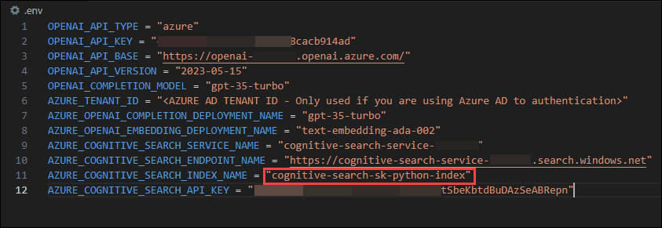 

1. Navigate back to **acs-sk-python.ipynb** file, **Execute the notebook cell by cell** (using either Ctrl + Enter to stay on the same cell or Shift + Enter to advance to the next cell) and observe the **results of each cell** execution.
  
   > **Note**: Make sure **Python Environmen** is in a ready State, If not please wait for 15 to 20 seconds.

        

### Review

In this lab, you have provisioned an Azure OpenAI resource, deployed a model, set up the configuration for AI Orchestration, and performed various tasks related to ACS.
