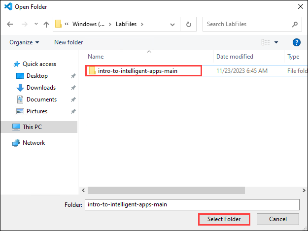
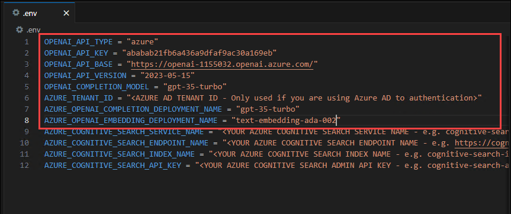
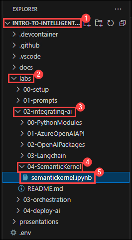
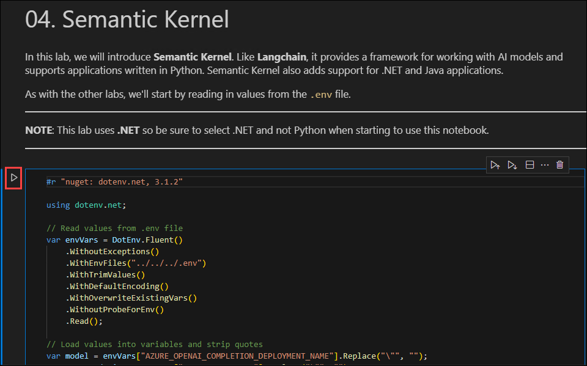

# Exercise 9B: C# based notebooks to develop on Semantic Kernal

## Lab objectives

In this lab, you will perform:

- Provision an Azure OpenAI resource
- Deploy a model
- Set up the configuration for Integrating AI to run notebooks in Semantic Kernal.

## Architecture Diagram

### Task 1: Setup configuration for Integrating AI

1. Open **Visual Studio Code** from the Lab VM desktop by double-clicking on it.

   

1. In Visual Studio Code from menu bar select **File(1)>open folder(2)**.   

   

1. Within **File Explorer**, navigate to **C:\LabFiles** select **intro-to-intelligent-apps-main**(1) click on **Select folder(2)**

   

1. In **Visual Studio Code**, click on **Yes, I trust the authors** when **Do you trust the authors of the files in this folder?** window prompted.

   

1. Click on **.env**, replace the values and save the file by pressing **ctrl + s**.

   | **Variables**                            | **Values**                                                                              |
   | ---------------------------------------- |-----------------------------------------------------------------------------------------|
   | OPENAI_API_TYPE                          |  **azure**                                                                              |
   | OPENAI_API_KEY                           | Replace the value with the **AZURE OPENAI API KEY** which you noted in Exercise 4A Task 1 step 2  |
   | OPENAI_API_BASE                          | Replace the value with the **AZURE OPENAI ENDPOINT** which you noted in Exercise 4A Task 1 step 2   |
   | OPENAI_COMPLETION_MODEL                  | **gpt-35-turbo-16k**                                                                        |
   | AZURE_OPENAI_COMPLETION_DEPLOYMENT_NAME  | **gpt-35-turbo-16k**                                                                        |
   | AZURE_OPENAI_EMBEDDING_DEPLOYMENT_NAME   | **text-embedding-ada-002**                                                              |

      

### Task 2: Develop on Semantic Kernal

1. In the Visual Studio Code navigate to **intro-to-intelligent-apps-main/labs/02-integrating-ai/04-SemanticKernel** folder and select **semantickernel.ipynb**

   

1. From the right corner click on **select Kernal** and on the Choose a Kernel source pop-up, select available **Select Another Kernal**. As we required .Net Kernal to perform the exercise. 

   

1. Select **.Net Interactive** as a kernel

   

1. **Execute the notebook cell by cell** (using either Ctrl + Enter to stay on the same cell or Shift + Enter to advance to the next cell) and observe the **results of each cell** execution.
  
   > **Note**: Make sure **.Net Interactive** is in ready State, If not please wait for 15 to 20 seconds.

      
